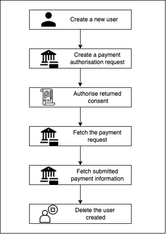

# Examples

## Structure
This folder contains examples on how to use the openapigenerator to create the codeclient used to interact with the Yapily API.
Each language has a `generate` script that showcases the flow used to generate the packages and run the entry scripts

## Testing credentials

To connect to the Yapily API, you will need to register your [application](https://dashboard.yapily.com).

Specify the financial institutions you want to work with and save your application. You will then be prompted to download your application credentials. These application credentials can then be used to authorise your requests against the yapily API.

## Flows

The presented examples contain helpful implementations of the following flows:

### AIS


#### Glossary

| request                                 | description                                                                                                       |     |
| --------------------------------------- | ---------------------------------------------------------------------------------------------------------------- | -------- |
| Create a new user                       | This request creates a new user for the application                                                              | [Go to docs](https://docs.yapily.com/api/reference/#operation/addUser) |
| Create an account authorisation request | This request submits and authorisation request which upon validation will return a consent authorisation request | [Go to docs](https://docs.yapily.com/api/reference/#operation/initiateAccountRequest) |
| Authorise the returned consent          | Request that mimicks user interaction with the consent and changes the state of the consent                    |  |
| Fetch account information               | Request returning more information about the account of the consent owner                                        | [Go to docs](https://docs.yapily.com/api/reference/#operation/getAccount) |
| Fetch account transactions information  | Request returning more information about the transactions linked to the consent owner                            | [Go to docs](https://docs.yapily.com/api/reference/#operation/getTransactions) |
| Delete the user created                 | Request used to remove the previously created user                                                               | [Go to docs](https://docs.yapily.com/api/reference/#operation/deleteUser) |

### PIS


#### Glossary

| request                                | descrption                                                                                                    |      |
| -------------------------------------- | ------------------------------------------------------------------------------------------------------------- | -------- |
| Create a new user                       | This request creates a new user for the application                                                              | [Go to docs](https://docs.yapily.com/api/reference/#operation/addUser) |
| Create a payment authorisation request | This request submits and authorisation request which upon validation will return a consent authorisation link | [Go to docs](https://docs.yapily.com/api/reference/#operation/createPaymentAuthorisation) |
| Authorise the returned consent         | Request that validates user interaction with the consent and changes the state of the consent                 |  |
| Create the payment request             | Request containing the information required to create the payment                                             | [Go to docs](https://docs.yapily.com/api/reference/#operation/createPayment) |
| Fetch submitted payment information    | Request returning more information about the previous payment                                                 | [Go to docs](https://docs.yapily.com/api/reference/#operation/getPayments) |
| Delete the user created                 | Request used to remove the previously created user                                                               | [Go to docs](https://docs.yapily.com/api/reference/#operation/deleteUser) |
## Usage

All example scripts share one common step, fetching the `openapi.json` spec file.

However, each language handles the generation and testing differently:

* Java 
    
    In `java`, we have a Maven project that will install all dependencies and compile the OAS file in models and api definitions.
    Those are then stored in `target/generated-sources` and can be used in services which act like wrappers around the APIClient calls.
    Each service comes with it's own test and `examples/java/src/test/java/com/yapily/openapi/service/SuiteTest.java` tests the AIS and PIS flows by calling all endpoints.


* Python 
    
    In `python`, `generate.sh` will install a virtual env, then all dependencies and compile the OAS file in models and api definitions.
    Those are then stored in `codegen_client` and we need to relocate out test script `main.py` into the package, so it can use make the APIClient calls.
    The generate script calls the `main.py [ARGS...]` file twice, passing the flow to be followed as an param:
    ``` 
    python3 main.py AIS
    
    python3 main.py PIS
    ```

* Node 
    
    In `node`, the package.json file contains two scripts which are called from `generate.sh` First one generates the openapi client using the oas file provided. 
    Afterwards, it packages the codeclient as a folder `dist`. This is the package of the APIClient and is used in `script.js`.
    Same as the Python example, the script is called twice, once for each flow:
    ```
    "scripts": {
    "build-oas": "openapi-generator-cli generate -i openapi.json -g javascript -o generated-sources/openapi --additional-properties=usePromises=true",
    -> "start-ais": "node index.js AIS",
    -> "start-pis": "node index.js PIS"
    },
    ```